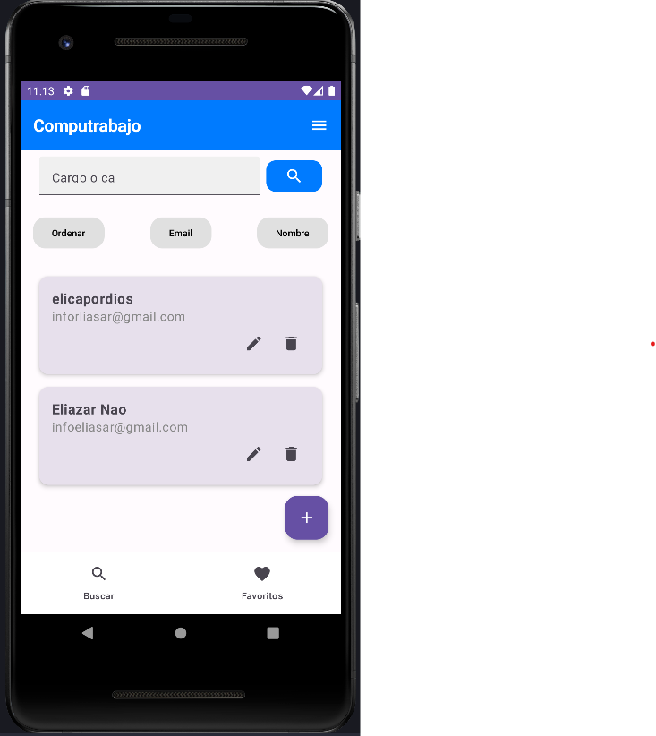

# Proyecto: Bolsa Laboral con Gestión de Usuarios

Este proyecto es una aplicación de bolsa laboral desarrollada en Android utilizando Jetpack Compose y Kotlin. La aplicación permite a los usuarios (candidatos y empresas) gestionar perfiles, publicar y buscar ofertas de trabajo, aplicar a dichas ofertas y comunicarse entre sí. Además, los administradores pueden gestionar roles y permisos, así como moderar el contenido.

## Descripción General

La aplicación está diseñada para ofrecer una plataforma donde los candidatos puedan buscar y aplicar a ofertas de trabajo publicadas por diversas empresas. Las empresas, por su parte, pueden gestionar sus ofertas y recibir aplicaciones de candidatos, facilitando el proceso de selección. La interfaz de usuario está construida utilizando Jetpack Compose, lo que permite una experiencia moderna y responsiva.

## Características Principales

- **Gestión de Usuarios:** Registro, inicio de sesión y recuperación de contraseñas para candidatos y empresas.
- **Gestión de Ofertas:** Publicación, edición y eliminación de ofertas de trabajo por parte de las empresas.
- **Búsqueda y Filtrado:** Herramientas de búsqueda y filtrado avanzadas para encontrar ofertas relevantes.
- **Aplicación a Ofertas:** Los candidatos pueden aplicar directamente a las ofertas utilizando su currículum y carta de presentación.
- **Notificaciones:** Alertas y notificaciones personalizadas basadas en las preferencias de los usuarios.
- **Mensajería:** Comunicación directa entre candidatos y empresas.
- **Gestión de Administradores:** Control de roles, permisos y moderación de contenido.

## Requisitos del Sistema

### Requisitos Funcionales

#### Gestión de Usuarios

- **Registro de usuarios:** Los candidatos y empresas pueden registrarse en la aplicación proporcionando información básica.
- **Inicio de sesión y recuperación de contraseñas:** Los usuarios pueden iniciar sesión y recuperar sus contraseñas en caso de olvido.
- **Gestión de perfiles de usuario:** Los usuarios pueden actualizar su información personal, educativa y laboral.

#### Publicación de Ofertas de Trabajo

- **Publicación de ofertas:** Las empresas pueden publicar nuevas ofertas de trabajo con detalles completos.
- **Edición y eliminación:** Las empresas pueden editar o eliminar ofertas ya publicadas.
- **Fecha de vencimiento:** Las ofertas pueden tener fechas de vencimiento definidas.

#### Búsqueda y Filtrado de Ofertas

- **Búsqueda por criterios:** Los candidatos pueden buscar ofertas por título, ubicación, salario, y categoría.
- **Filtrado:** Las ofertas se pueden filtrar por empresa, fecha de publicación, y relevancia.
- **Visualización de detalles:** Los usuarios pueden ver los detalles completos de cada oferta.

#### Aplicación a Ofertas de Trabajo

- **Aplicación a ofertas:** Los candidatos pueden aplicar directamente a las ofertas utilizando su currículum y carta de presentación.
- **Gestión de solicitudes:** Las empresas pueden gestionar las solicitudes recibidas de los candidatos.

#### Notificaciones y Alertas

- **Nuevas ofertas:** Los usuarios reciben notificaciones sobre nuevas ofertas que coincidan con sus preferencias.
- **Estado de aplicaciones:** Los candidatos son notificados sobre el estado de sus aplicaciones.

#### Interacción y Comunicación

- **Mensajería:** Los candidatos y las empresas pueden comunicarse entre sí a través de un sistema de mensajería interna.
- **Coordinación de entrevistas:** Las empresas pueden utilizar la mensajería para coordinar entrevistas con los candidatos.

#### Gestión de Administradores

- **Gestión de roles y permisos:** Los administradores pueden asignar roles y permisos a los usuarios.
- **Moderación de contenido:** Los administradores pueden moderar contenido y tomar acciones sobre contenido inapropiado.

## Requisitos No Funcionales

- **Rendimiento:** La aplicación debe ser rápida y responsiva, manejando eficientemente grandes volúmenes de datos.
- **Seguridad:** Los datos de los usuarios deben estar protegidos mediante mecanismos de seguridad robustos como encriptación y autenticación segura.
- **Escalabilidad:** La arquitectura debe soportar la adición de nuevas funcionalidades y el aumento de la base de usuarios sin degradar el rendimiento.
- **Compatibilidad:** La aplicación debe ser compatible con las versiones recientes de Android.

## Tecnologías Utilizadas

- **Lenguaje de Programación:** Kotlin
- **Framework de Interfaz de Usuario:** Jetpack Compose
- **Gestión de Estados:** ViewModel
- **Navegación:** Jetpack Navigation
- **Base de Datos Local:** Room
- **Inyección de Dependencias:** Hilt

## Arquitectura MVVM del Proyecto
El proyecto sigue la arquitectura MVVM (Model-View-ViewModel). A continuación se muestra la estructura de carpetas y archivos:

├── models
├── navigation
├── room
├── states
├── ui
├── viewmodels
└── views

**MainActivity.kt**: Archivo principal donde se inicia la actividad de la aplicación.

## Instalación y Configuración

1. **Clonar el repositorio:**
   ```bash
   git clone https://github.com/tu_usuario/bolsa_laboral.git
2. **Abrir el proyecto en Android Studio.**
2. **Configurar las dependencias del proyecto:**
    - Asegúrate de que todas las dependencias están correctamente configuradas en el archivo `build.gradle`.
3. **Configura la version JDK del proyecto a la version 17.0.**
4. **Ejecutar la aplicación en un emulador o dispositivo físico.**

## Contribuciones

Las contribuciones al proyecto son bienvenidas. Por favor, sigue los siguientes pasos:

1. Haz un fork del repositorio.
2. Crea una rama nueva para tu funcionalidad (`git checkout -b feature/nueva-funcionalidad`).
3. Realiza los cambios necesarios y realiza commits (`git commit -m 'Agrega nueva funcionalidad'`).
4. Haz push a la rama (`git push origin feature/nueva-funcionalidad`).
5. Abre un Pull Request.

## Licencia

Este proyecto está licenciado bajo la Licencia MIT. Ver el archivo [LICENSE](LICENSE) para más detalles.

## imagenes

